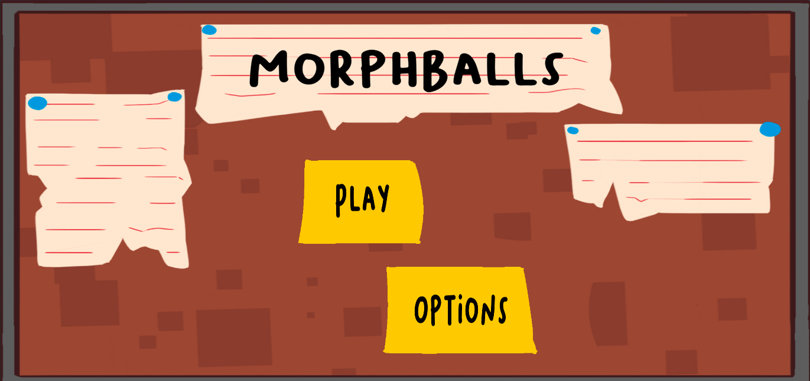

# MorphBalls

Morphballs es un videojuego estilo cartoon para celular donde controlaras una pelota que debera atravesar por distintos obstaculos utilizando u inteligencia para asi usar las fisicas del juegos a tu favor.

##  Características

-  Sistema de fisicas avanzadas
-  Sistema de niveles con dificultad en aumento
-  Gráficos estilo cartoon


##  Tecnologías utilizadas

- Unity 2D
- C#
- Photoshop

## Capturas de pantalla

<p align="center">
  
  
  
  
  
</p>

##  Cómo ejecutar el proyecto

1. Clona el repositorio:
```bash
https://github.com/CapitanPulido/LuisBalls/tree/610fca46a9ad40386d206fea06b538bf8434cf6d
